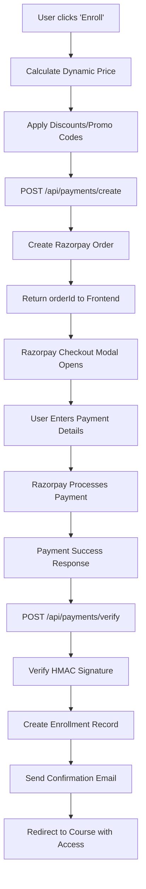

# Razorpay API Integration Strategy

## 🎯 Overview

This document outlines the comprehensive Razorpay API integration strategy for ShriArya LMS, focusing on dynamic pricing, automated course access, and scalable payment processing.

---

## 💡 Why Razorpay API (Not Static Links)?

### ✅ **Full Backend Control — Dynamic Pricing**

Using Razorpay API enables dynamic order generation from the backend:

```js
razorpay.orders.create({
  amount: calculateDynamicPrice(user, course, discounts),
  currency: "INR",
  receipt: `course_${courseId}_${userId}`,
});
```

**Benefits:**

- Each course can have **dynamic pricing** based on user type, season, or promotions
- **Real-time discount application** (coupons, early bird, referral codes)
- **User-specific pricing** (student discounts, bulk purchases)
- **GST calculation** and tax handling in code

### 🔐 **Instant Course Access After Payment**

**Payment Success Flow:**

1. Razorpay processes payment
2. Frontend receives success response via `handler` callback
3. Backend verifies payment signature (HMAC SHA256)
4. **Automatic course enrollment** in database
5. **Instant access granted** to course content
6. Confirmation email/SMS sent

```js
// Example: Auto-enrollment on payment success
if (verifiedPayment) {
  await supabase.from("courses_enrollments").insert({
    student_id: userId,
    course_id: courseId,
    is_active: true,
    enrolled_at: new Date().toISOString(),
  });

  // Send welcome email
  await sendWelcomeEmail(userEmail, courseTitle);
}
```

### 🎯 **Dynamic Product Catalog**

**Database-Driven Pricing:**

```json
{
  "courses": [
    {
      "id": "ibdp-math-aa-hl",
      "title": "IBDP Mathematics AA HL",
      "base_price": 9999,
      "currency": "INR",
      "discounts": {
        "early_bird": 0.2,
        "student": 0.15,
        "bulk": 0.25
      }
    }
  ]
}
```

**Dynamic Price Calculation:**

```js
function calculatePrice(course, user, promoCode) {
  let price = course.base_price;

  // Apply user-specific discounts
  if (user.isStudent) price *= (1 - course.discounts.student);
  if (user.isEarlyBird) price *= (1 - course.discounts.early_bird);

  // Apply promo codes
  if (promoCode) {
    const discount = await validatePromoCode(promoCode);
    price *= (1 - discount.percentage);
  }

  // Seasonal offers
  if (isFestivalSeason()) price *= 0.9;

  return Math.round(price);
}
```

---

## 🏗️ Architecture Overview

### **Backend Components**

1. **Payment Service Layer** (`src/lib/payments/`)

   - `config.ts` - Configuration, types, and validation
   - `razorpay.ts` - Razorpay-specific service (orders, verification, refunds)
   - `index.ts` - Unified payment service interface

2. **API Routes**

   - `POST /api/payments/create` - Creates Razorpay order with dynamic pricing
   - `POST /api/payments/verify` - Verifies payment & creates enrollment
   - `POST /api/payments/refund` - Processes refunds
   - `GET /api/payments/methods` - Get available payment methods

3. **Database Integration**
   - `payments` table - All payment transactions
   - `courses_enrollments` table - Auto-enrollment on success
   - `promo_codes` table - Discount management
   - `payment_webhooks` table - Webhook event tracking

### **Frontend Components**

1. **Payment Flow** (`src/components/payments/`)

   - `PaymentFlow.tsx` - Main payment orchestration
   - `PaymentMethodSelector.tsx` - Method selection UI
   - `RazorpayPayment.tsx` - Razorpay checkout modal
   - `DiscountCodeInput.tsx` - Promo code application

2. **Integration Points**
   - `/cart` - Multi-course checkout with bulk discounts
   - `/courses/[slug]/payment` - Single course payment
   - `/test-payment` - Testing and debugging

---

## 🔄 Complete Payment Flow



---

## 💸 Advanced Features

### **1. Dynamic Discount System**

```js
// Promo Code Validation
async function validatePromoCode(code, userId, courseId) {
  const promo = await supabase
    .from("promo_codes")
    .select("*")
    .eq("code", code)
    .eq("is_active", true)
    .single();

  if (!promo) return { valid: false, error: "Invalid code" };

  // Check usage limits
  const usageCount = await supabase
    .from("payments")
    .select("id")
    .eq("promo_code", code)
    .gte("created_at", promo.valid_from);

  if (usageCount.length >= promo.max_uses) {
    return { valid: false, error: "Code usage limit reached" };
  }

  return {
    valid: true,
    discount: promo.discount_percentage,
    discount_amount: promo.discount_amount,
  };
}
```

### **2. Seasonal Pricing**

```js
// Festival Season Pricing
function applySeasonalPricing(basePrice) {
  const now = new Date();
  const festivals = [
    { name: "Diwali", start: "2024-11-01", end: "2024-11-15", discount: 0.2 },
    {
      name: "New Year",
      start: "2024-12-25",
      end: "2025-01-05",
      discount: 0.15,
    },
  ];

  for (const festival of festivals) {
    if (now >= new Date(festival.start) && now <= new Date(festival.end)) {
      return basePrice * (1 - festival.discount);
    }
  }

  return basePrice;
}
```

### **3. Bulk Purchase Discounts**

```js
// Cart-based bulk discounts
function calculateBulkDiscount(courses) {
  const totalCourses = courses.length;

  if (totalCourses >= 5) return 0.3; // 30% off for 5+ courses
  if (totalCourses >= 3) return 0.2; // 20% off for 3+ courses
  if (totalCourses >= 2) return 0.1; // 10% off for 2+ courses

  return 0;
}
```

---

## 🔐 Security Implementation

### **1. Payment Signature Verification**

```js
// HMAC SHA256 verification
function verifyPaymentSignature(orderId, paymentId, signature) {
  const crypto = require("crypto");
  const hmac = crypto.createHmac("sha256", process.env.RAZORPAY_KEY_SECRET);
  hmac.update(`${orderId}|${paymentId}`);
  const generatedSignature = hmac.digest("hex");

  return generatedSignature === signature;
}
```

### **2. Webhook Security**

```js
// Webhook signature verification
function verifyWebhookSignature(body, signature) {
  const crypto = require("crypto");
  const hmac = crypto.createHmac("sha256", process.env.RAZORPAY_WEBHOOK_SECRET);
  hmac.update(body);
  const generatedSignature = hmac.digest("hex");

  return generatedSignature === signature;
}
```

---

## 📊 Analytics & Reporting

### **1. Payment Analytics**

```js
// Track conversion metrics
async function trackPaymentAnalytics(paymentData) {
  await supabase.from("payment_analytics").insert({
    course_id: paymentData.courseId,
    amount: paymentData.amount,
    currency: paymentData.currency,
    payment_method: paymentData.method,
    user_country: paymentData.userCountry,
    conversion_source: paymentData.source,
    created_at: new Date().toISOString(),
  });
}
```

### **2. Revenue Reporting**

```js
// Monthly revenue report
async function getMonthlyRevenue(month, year) {
  const { data } = await supabase
    .from("payments")
    .select("amount, currency, course_id, created_at")
    .gte("created_at", `${year}-${month}-01`)
    .lt("created_at", `${year}-${month + 1}-01`)
    .eq("status", "completed");

  return data.reduce((total, payment) => total + payment.amount, 0);
}
```

---

## 🚀 Implementation Roadmap

### **Phase 1: Core Integration** ✅

- [x] Razorpay API setup
- [x] Order creation
- [x] Payment verification
- [x] Auto-enrollment
- [x] Basic error handling

### **Phase 2: Dynamic Pricing** 🔄

- [ ] Promo code system
- [ ] Seasonal discounts
- [ ] User-specific pricing
- [ ] Bulk purchase discounts

### **Phase 3: Advanced Features** 📋

- [ ] Webhook integration
- [ ] Refund management
- [ ] Payment analytics
- [ ] Invoice generation

### **Phase 4: Optimization** 📋

- [ ] A/B testing for pricing
- [ ] Conversion optimization
- [ ] Advanced reporting
- [ ] Multi-currency support

---

## 🧪 Testing Strategy

### **Test Cards**

| Card Number         | Type       | Result  |
| ------------------- | ---------- | ------- |
| 4111 1111 1111 1111 | Visa       | Success |
| 5555 5555 5555 4444 | Mastercard | Success |
| 4000 0000 0000 0002 | Visa       | Failure |

### **Test Scenarios**

1. **Single Course Payment** - Basic flow testing
2. **Cart Checkout** - Multi-course with bulk discounts
3. **Promo Code Application** - Discount validation
4. **Payment Failure** - Error handling
5. **Refund Processing** - Refund flow testing

---

## 📈 Success Metrics

### **Key Performance Indicators**

- **Conversion Rate**: Payment completion rate
- **Average Order Value**: Revenue per transaction
- **Discount Effectiveness**: Promo code usage impact
- **Payment Method Distribution**: UPI vs Cards vs Net Banking
- **Geographic Performance**: Payment success by country/region

### **Monitoring Dashboard**

- Real-time payment status
- Revenue tracking
- Failed payment analysis
- Popular payment methods
- Course enrollment correlation

---

## 🔧 Configuration

### **Environment Variables**

```env
# Razorpay Configuration
RAZORPAY_KEY_ID=rzp_test_xxxxxxxxxxxx
RAZORPAY_KEY_SECRET=xxxxxxxxxxxxxxxxxxxx
NEXT_PUBLIC_RAZORPAY_KEY_ID=rzp_test_xxxxxxxxxxxx
RAZORPAY_WEBHOOK_SECRET=xxxxxxxxxxxxxxxxxxxx

# Database
NEXT_PUBLIC_SUPABASE_URL=your_supabase_url
NEXT_PUBLIC_SUPABASE_ANON_KEY=your_supabase_anon_key
SUPABASE_SERVICE_ROLE_KEY=your_service_role_key
```

### **Database Schema**

```sql
-- Payments table
CREATE TABLE payments (
  id uuid PRIMARY KEY DEFAULT gen_random_uuid(),
  user_id uuid NOT NULL REFERENCES auth.users(id),
  course_id uuid NOT NULL REFERENCES courses(id),
  amount numeric NOT NULL,
  currency varchar NOT NULL DEFAULT 'INR',
  provider varchar NOT NULL CHECK (provider IN ('razorpay')),
  payment_id varchar NOT NULL,
  order_id varchar,
  status varchar NOT NULL DEFAULT 'pending',
  promo_code varchar,
  discount_amount numeric DEFAULT 0,
  created_at timestamptz DEFAULT now()
);

-- Promo codes table
CREATE TABLE promo_codes (
  id uuid PRIMARY KEY DEFAULT gen_random_uuid(),
  code varchar UNIQUE NOT NULL,
  discount_percentage numeric,
  discount_amount numeric,
  max_uses integer,
  valid_from timestamptz,
  valid_until timestamptz,
  is_active boolean DEFAULT true,
  created_at timestamptz DEFAULT now()
);
```

---

## 🎉 Conclusion

The Razorpay API integration provides:

✅ **Dynamic Pricing** - Real-time price calculation with discounts  
✅ **Instant Access** - Automatic course enrollment on payment success  
✅ **Scalable Architecture** - Handles multiple courses and payment methods  
✅ **Security** - HMAC signature verification and fraud prevention  
✅ **Analytics** - Comprehensive payment tracking and reporting  
✅ **Flexibility** - Easy integration with existing LMS features

This strategy enables ShriArya LMS to offer a seamless, secure, and scalable payment experience while maintaining full control over pricing, discounts, and course access management.

---

**Last Updated:** October 23, 2024  
**Status:** ✅ Core Integration Complete  
**Next Phase:** Dynamic Pricing Implementation
